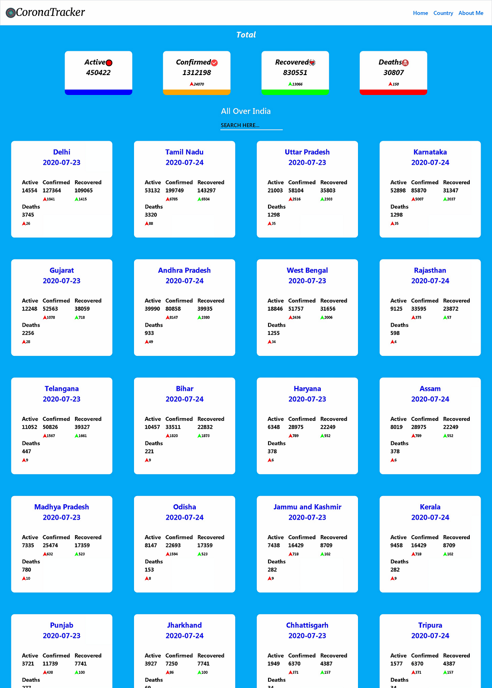
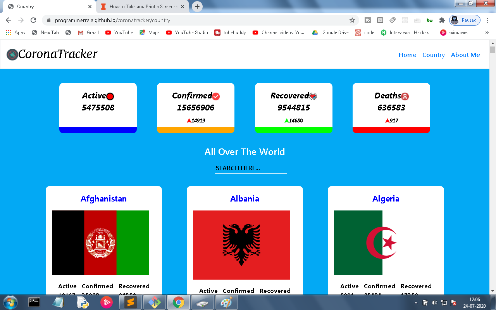
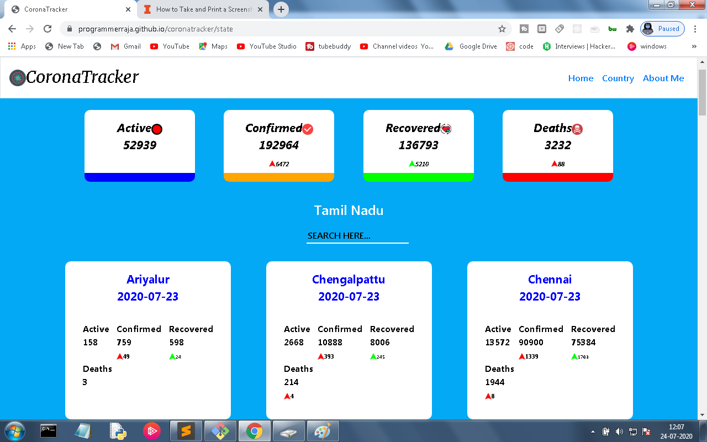

# CoronaTracker

hello guys i build this website to track corona effect in india and around the world by using the covid19india <a href="https://api.covid19india.org/"> API </a> to display the deatil of corona effects in india 
and for show the world wide details by using  <a href="https://corona.lmao.ninja/"> lmao API</a>

# how i build this ?
 
 I use html,css,javascript ,boootstrap and jquery to build this website it take around 2 days for me. 
in home page you will see the total active ,confirmed,recovered,deaths case in india and  the list of state name with corresponding case.
once you click the the state name it will get you to the details about the praticular state . 

I use bootstrap(only used for navigation) and media query for responsive website 

# what are the skills i learned from  it  ?
  <ul>
 <li> Jquery</li>
 <li> bootstrap</li>
 <li> how to handle with API </li>
 <li> JS ASYNC </li>
 <li>Design mobile first website (but i make a mistake. i design it  for computer first )</li>
 <li>sharaing data between two pages using local storage</li>
 </ul>
 
take look the website here <a href="https://programmerraja.github.io/coronatracker/index">click here </a>

# what are problem need to fix ?
<ul>
 <li> using other than local storage to share data between two page(fixed change local storrage to session storage at 18-07-2020 9:05PM ) </li>
 <li> have inline css  need to put in seprate file (fixed make separate css file at 24-07-2020 11:30AM )</li>
 </ul>

# website preview

 
 

  

